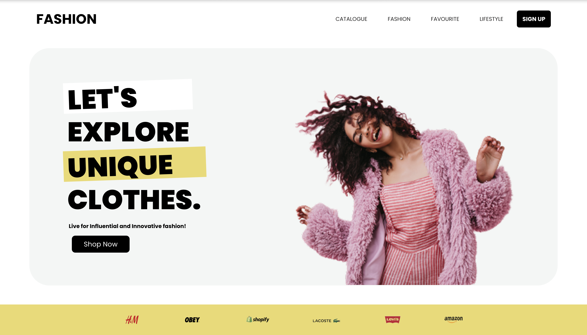
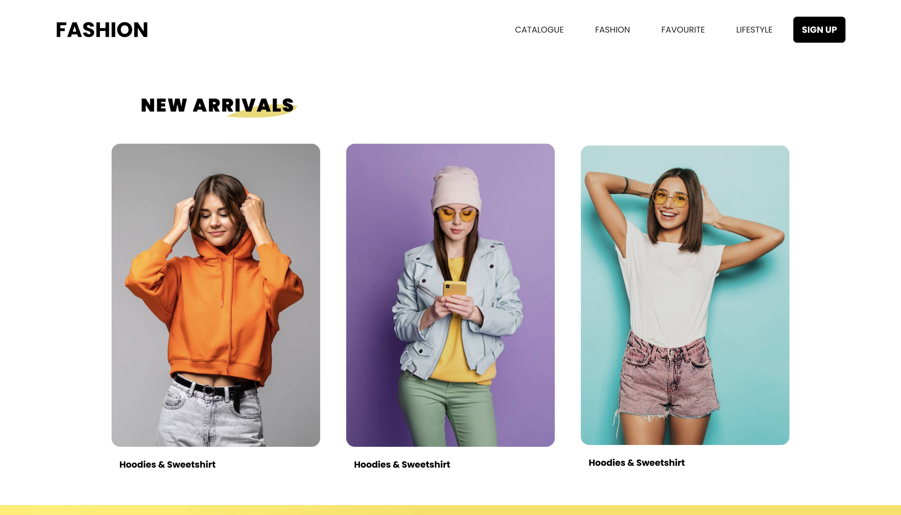
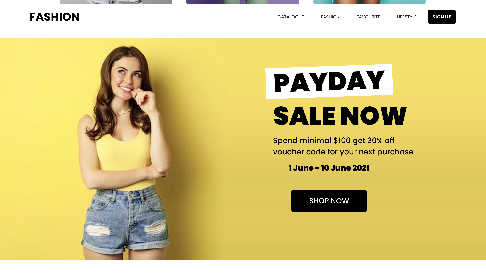
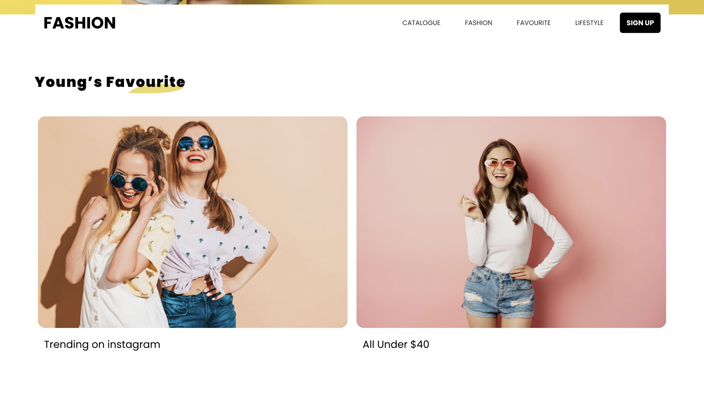

# Fashion Website
This is a simple website built with React for training purposes.

## 💻 Project Preview

  
  
  
  
  

## 📚 Technologies Used
- React
- CSS

## 🚀 Getting Started
1. Clone the repository
2. Run `npm install`
3. Run `npm start`
